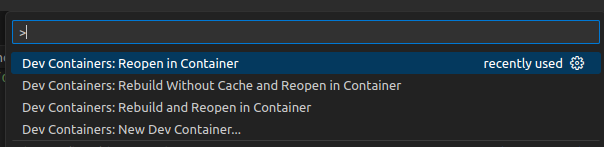
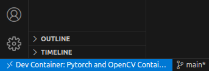
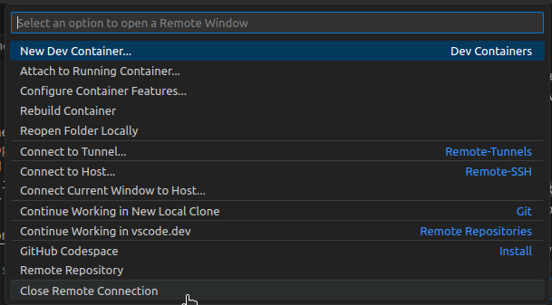

# ML-Term-Project
Machine Learning Term Project

## Background for Visual Odometry

| Topics | Description | Reference Links | Other |
|--------------|-------------|--------------------------|-------|
| Dataset | KITTI dataset | [KITTI raw data](https://www.cvlibs.net/datasets/kitti/raw_data.php) | - |

## Working environment (Runs in a docker)

### Pre-requisites
1. Install [Docker](https://docs.docker.com/get-docker/)
2. Install [Nvidia-Docker](http://web.archive.org/web/20230627162323/https://docs.nvidia.com/datacenter/cloud-native/container-toolkit/latest/install-guide.html)

### Method 1: Run the docker using command
#### Step 1: Build and Run the image
```bash
# Make sure you are in the Real-Time-VIO/docker directory
docker-compose up --build -d 
```

#### Step 2: Attach to the container
```bash
# Make sure you are in the Real-Time-VIO/docker directory
docker attach pytorch-vio
```
```bash
# If success, your terminal should show:
user@{your computer name}:~/ML_ws$
```
#### To exit the container
```bash
# (Inside the docker)
exit
```

### Method 2: Run the docker with devcontainer (in VS Code)
#### Step 1
- Go to "Extensions" window in VS Code (or use `Ctrl+Shift+x`), search for "Remote Development" and install it.
#### Step 2
- In VS Code, use `View->Command Palette...` or simply use `Ctrl+Shift+P` to open the Command Palette window.
#### Step 3
- If it is the first time you building the docker, you can choose both `Dev Containers: Rebuild Without Cache and Reopen in Container` or `Dev Containers: Rebuild and Reopen in Container` to build the docker.
- If you want to rebuild your old docker image, please choose `Dev Containers: Reopen in Container`. Otherwise any other packages you installed (if any) in the environment will be lost.

```bash
# Same, if success, your terminal should show:
user@{your computer name}:~/ML_ws$
```
#### To exit
- First, press the blue button on the bottom-left corner in VS Code (as shown in the following image) to open the remote window.\

- Second, choose `Close Remote Connection` in the remote window to close the connection.\

#### Reference
[https://code.visualstudio.com/docs/devcontainers/containers](https://code.visualstudio.com/docs/devcontainers/containers)